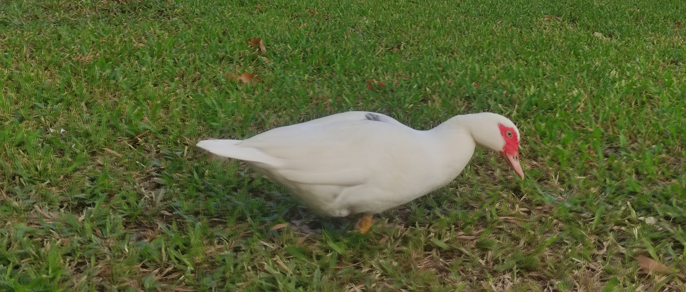
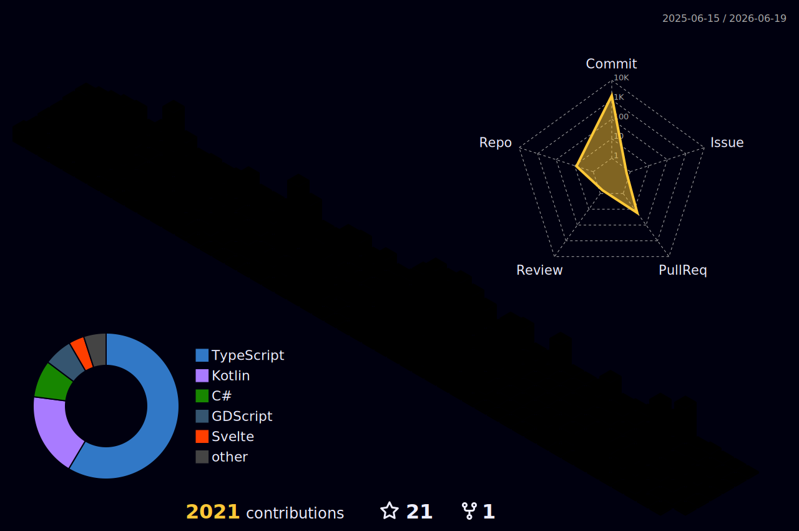

#  
Desde mis inicios en la programación hace 4 años, me he comprometido al máximo con cada proyecto.
Lo que más me apasiona es transformar los obstáculos en logros, impulsando el éxito del
equipo y el cumplimiento de los objetivos.

Me atraen los proyectos que facilitan el día a día de las personas. Prueba [**Grader**](https://play.google.com/store/apps/details?id=com.app.grader), mi app para administrar calificaciones escolares.

**🎓 Estudiante de ing. Informática en la UCAB.**

## Actualmente...

