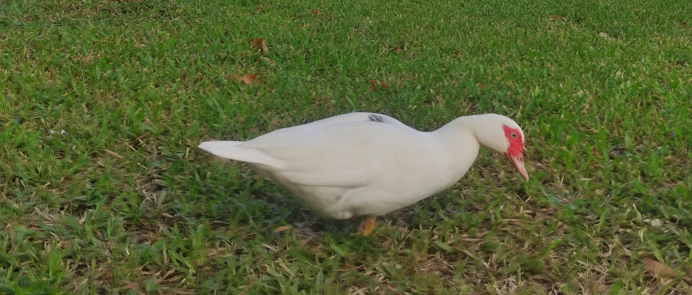
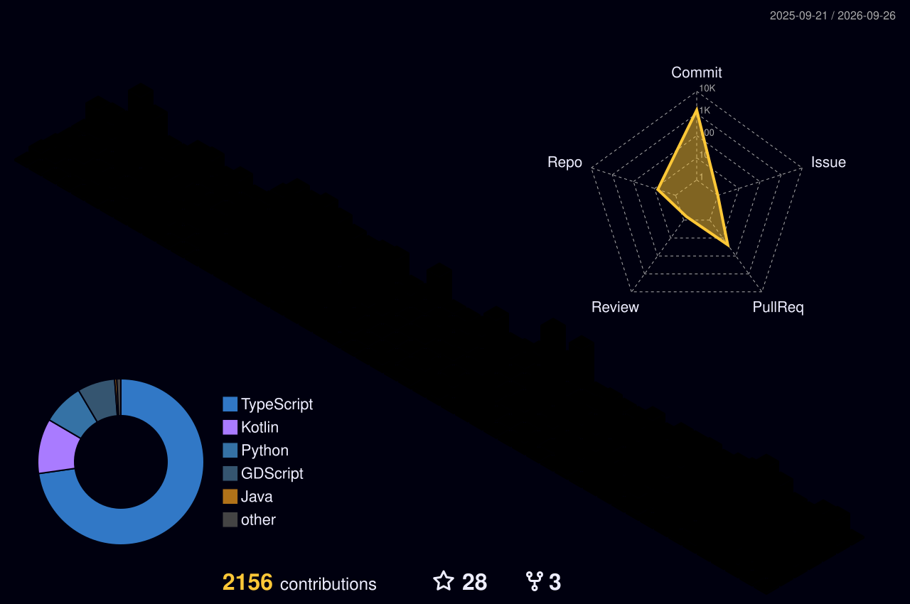

#  
Desde mis inicios en la programación hace 4 años, me he comprometido al máximo con cada proyecto. Llevo a la realidad propuestas que resuelven problemas reales.

Me atraen los proyectos que facilitan el día a día de las personas. 
- [**Grader**](https://play.google.com/store/apps/details?id=com.app.grader), mi app para administrar calificaciones escolares.
- [**Materias Internacionales Noticias Bot**](https://t.me/materiasInterNoticiasBot), Bot de Telegram para enterarte de las últimas materias candidatas para electivas internacionales en la UCAB.

**🎓 Estudiante de ing. Informática en la UCAB.**

## Actualmente...

