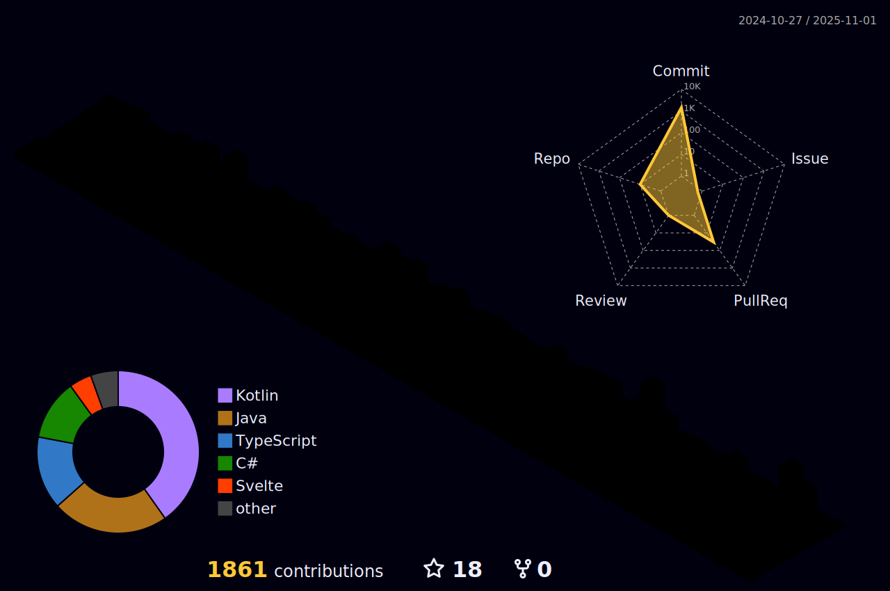

#  
Desde mis inicios en la programación hace 2 años me he comprometido al máximo con cada proyecto.
Lo que más me apasiona es transformar los obstáculos en logros, impulsando el éxito del
equipo y el cumplimiento de los objetivos.

**🎓 Estudiante de ing. Informática en la UCAB.**

## Actualmente...

